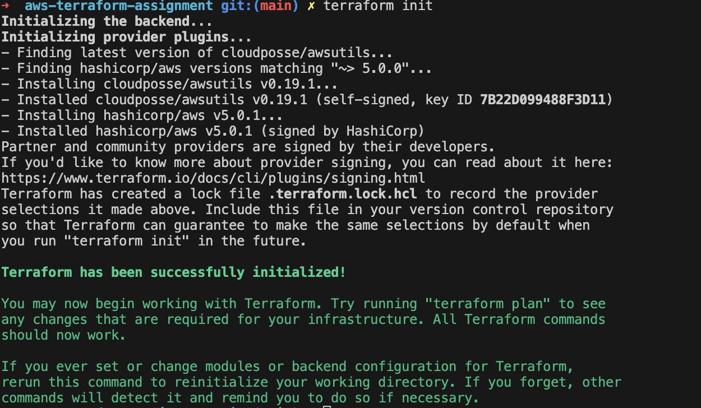
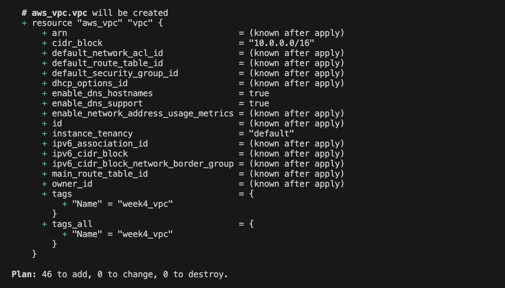
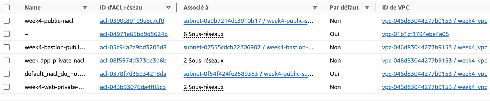
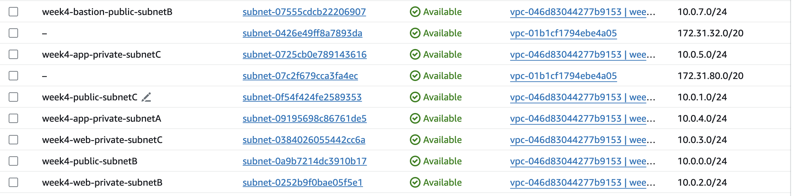
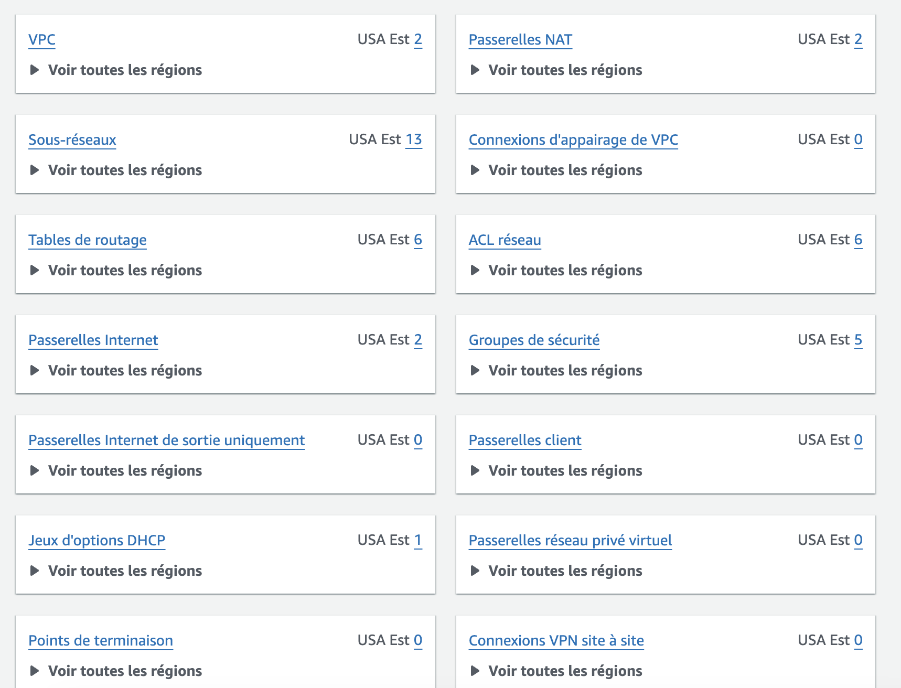

# terrafrom-week4

# Descriptionn

The aim of this projet is insfrastructure as code using teraform

### Prerequisites:

- python
- aws cli
- vs-code

### Teraform instruction

- terraform init



- terraform plan



### commage for apply configuration

```
terraform apply

```

### commage for apply configuration

```
terraform destroy

```

### Screenshot Of the process




